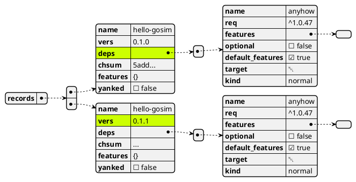

# From Git Index to Sparse Index

A Deep Dive

RUSTIN LIU

<div class="pt-12">
  <span @click="$slidev.nav.next" class="px-2 py-1 rounded cursor-pointer" hover="bg-white bg-opacity-10">
    Begin <carbon:arrow-right class="inline"/>
  </span>
</div>

---
transition: slide-up
---

# Rustin Liu

<div class="leading-8 opacity-80">
PingCAP Database Kernel Engineer.<br/>
Cargo Active Contributor.<br/>
Rustup Previous Maintainer.<br/>
Crates.io Previous Maintainer.<br/>
</div>

<div my-10 grid="~ cols-[40px_1fr] gap-y4" items-center justify-center>
  <div i-ri-github-line op50 ma text-xl/>
  <div><a href="https://github.com/hi-rustin" target="_blank">hi-rustin</a></div>
  <div i-ri-twitter-line op50 ma text-xl/>
  <div><a href="https://twitter.com/hi_rustin" target="_blank">hi_rustin</a></div>
  <div i-ri-firefox-line op50 ma text-xl/>
  <div><a href="https://hi-rustin.rs" target="_blank">hi-rustin.rs</a></div>
  <div i-ri-youtube-line op50 ma text-xl/>
  <div><a href="https://www.youtube.com/@hi-rustin" target="_blank">hi-rustin</a></div>
</div>


<div flex="~ gap2">
</div>

---
transition: slide-up
---
# Sparse Index

##### Big thanks to the Cargo and crates.io teams for building this feature over the past three years.

<br/>
<Timeline/>

---
transition: slide-up
layout: center
---

<div text-6xl fw100>
  Agenda
</div>

<br>

<div class="grid grid-cols-[3fr_2fr] gap-4">
  <div class="border-l border-gray-400 border-opacity-25 !all:leading-12 !all:list-none my-auto">

  - From Cargo to crates.io and back again
  - What is the problem?
  - How to solve it?
  - What is the result?
  - Q&A

  </div>
</div>

---
transition: slide-up
layout: center
---

# Architecture

<iframe style="border: 1px solid rgba(0, 0, 0, 0.1);" width="800" height="450" src="https://www.figma.com/embed?embed_host=share&url=https%3A%2F%2Fwww.figma.com%2Ffile%2FaWmwb7IwJcYaCYpaMX4Yyv%2FCargo-to-crates.io%3Ftype%3Dwhiteboard%26node-id%3D0%253A1%26t%3DpfzFBCkrzmTqMDOI-1" allowfullscreen></iframe>

---
transition: slide-left
layout: center
---

# From Cargo to crates.io

---
transition: slide-left
layout: two-cols-header
---

# From Cargo to crates.io

::left::

<div class="mx-2">

## cargo new --lib

<v-click>

```console
$ cargo new --lib hello-gosim
     Created library `hello-gosim` package
```

```rust
$ tree
.
├── Cargo.toml
└── src
    └── lib.rs
```

</v-click>

</div>

::right::

<div class="mx-2">


## cargo package

<v-click>

```console
$ cargo package --allow-dirty
...
    Packaged 3 files, 945.0B (738.0B compressed)
```

```rust{all|8,9}
$ tree -L 3
.
├── Cargo.toml
├── src
│   └── lib.rs
└── target
    └── package
        ├── hello-gosim-0.1.0
        └── hello-gosim-0.1.0.crate
```

```rust{all|2,3}
$ tar tzf ./target/package/hello-gosim-0.1.0.crate
hello-gosim-0.1.0/Cargo.toml
hello-gosim-0.1.0/Cargo.toml.orig
hello-gosim-0.1.0/src/lib.rs
```

</v-click>
</div>

---
transition: slide-left
---

# From Cargo to crates.io

## cargo publish

```console{all|4|6|7|10}
$ cargo publish --allow-dirty
    Updating crates.io index
    ...
   Packaging hello-gosim v0.1.0 (/Users/hi-rustin/hello-gosim)
    ...
   Uploading hello-gosim v0.1.0 (/Users/hi-rustin/hello-gosim)
    Uploaded hello-gosim v0.1.0 to registry `crates-io`
note: Waiting for `hello-gosim v0.1.0` to be available at registry `crates-io`.
You may press ctrl-c to skip waiting; the crate should be available shortly.
   Published hello-gosim v0.1.0 at registry `crates-io
```
<v-click>


</v-click>

---
transition: slide-up
---

# Index JSON file




---
transition: slide-left
layout: center
---

# From crates.io to Cargo

---
transition: slide-left
---

# Create a new project and add a dependency

## cargo new --bin

<v-click>

```console
$ cargo new --bin gosim
     Created binary (application) `gosim` package
```

</v-click>

## cargo add

<v-click>

```console
$ cargo add hello-gosim
    Updating crates.io index
      Adding hello-gosim v0.1.0 to dependencies.
    Updating crates.io index
```

</v-click>

## Cargo.toml

<v-click>

```toml
[package]
name = "gosim"
version = "0.1.0"
edition = "2021"

[dependencies]
hello-gosim = "0.1.0"
```

</v-click>

---
transition: slide-left
---

# Resolve dependencies with Git Index

<iframe style="border: 1px solid rgba(0, 0, 0, 0.1);" width="800" height="450" src="https://www.figma.com/embed?embed_host=share&url=https%3A%2F%2Fwww.figma.com%2Ffile%2FOArPQlLE77eyWaJcGplDSa%2FForm-crates.io-to-Cargo%3Ftype%3Dwhiteboard%26node-id%3D0%253A1%26t%3DIWZiFq6NrCUQtEsJ-1" allowfullscreen></iframe>


---
transition: slide-up
---

# From crates.io to Cargo with Git Index

## Change to Git Index

```toml{all|3}
# ~/.cargo/config.toml

registries.crates-io.protocol = "git"
```

## cargo build

```console{all|2|3,4|7}
$ cargo build
    Updating crates.io index
  Downloaded hello-gosim v0.1.0
  Downloaded 1 crate (785 B) in 2.02s
   Compiling hello-gosim v0.1.0
   Compiling gosim v0.1.0 (/Users/hi-rustin/gosim)
    Finished dev [unoptimized + debuginfo] target(s) in 1m 23s
```

---
transition: slide-left
layout: center
---

# What is the problem?

---
transition: slide-left
layout: two-cols-header
---

# It is too slow!

::left::

<div class="mx-2">
  
</div>

::right::

<div class="mx-2">

<v-click>

- Downloaded 1 crate (785 B) in **2.02s**
- Updating crates.io index in **1m 21s**

</v-click>

<v-click>

**68742 Commits in crates.io-index**


**Try it yourself on your machine!**

```console
$ time git clone https://github.com/rust-lang/crates.io-index
```

</v-click>

</div>

---
transition: slide-up
---

# Even worse!

## 1m 6s

<v-click>

```console{all|7}
time git clone https://github.com/rust-lang/crates.io-index
Cloning into 'crates.io-index'...
...
Receiving objects: 100% (489099/489099), 295.23 MiB | 8.09 MiB/s, done.
...

34.79s user 16.22s system 76% cpu 1:06.84 total
```

</v-click>

## 2m 39s

<v-click>

```console{all|3,4|6|10}
$ cd git2-rs

# Compile it first
$ cargo run -r -q --example clone

$ time cargo run -r -q --example clone https://github.com/rust-lang/crates.io-index ./crates.io-index
net  99% (302481 kb, 489093/489094)  /  idx  30% (151502/489094)  /  chk   0% (   0/   0)
Resolving deltas 337592/337592

95.01s user 30.31s system 78% cpu 2:39.32 tota
```

</v-click>

---
transition: slide-left
layout: center
---

# How to solve it?

---
transition: slide-left
---

# Let's squash it!

#### crates.io-index-archive: [Archive of the crates.io-index commit history after squashes](https://github.com/rust-lang/crates.io-index-archive)


---
transition: slide-left
---
# Still too slow!

## Can we speed up it with partial clone and shallow clone?

<v-click>

**Yes, but not at that time.** It took 8 years to implement shallow clone in [libgit2](https://github.com/libgit2/libgit2/issues/3058).

<br/>

<div>


</div>

</v-click>

---
transition: slide-left
---

# [gitoxide](https://github.com/Byron/gitoxide)

An idiomatic, lean, fast & safe pure Rust implementation of Git.

```console
cargo build -Zgitoxide=shallow-index,shallow-deps
```

- `shallow-index` - perform a shallow clone of the index.
<br/>

- `shallow-deps` - perform a shallow clone of git dependencies.

See more details in [Tracking Issue for -Zgitoxide](https://github.com/rust-lang/cargo/issues/11813)

---
transition: slide-left
---

# Sparse Index

Use a HTTP request to fetch the index file instead of a full clone.

```toml{all|3}
# ~/.cargo/config.toml

registries.crates-io.protocol = "sparse"
```

Store the index file in S3. And use [CloudFront](https://aws.amazon.com/cloudfront/) to cache it.

```rust
https://index.crates.io
```

See more details in [RFC: Serve crates-io registry over HTTP as static files](https://github.com/rust-lang/rfcs/pull/2789).

---
transition: slide-left
---

# Resolve dependencies with Sparse Index

<iframe style="border: 1px solid rgba(0, 0, 0, 0.1);" width="800" height="450" src="https://www.figma.com/embed?embed_host=share&url=https%3A%2F%2Fwww.figma.com%2Ffile%2FkfdHmymCqq5Gdr9jWTaA7h%2FForm-crates.io-to-Cargo-with-Sparse-Index%3Ftype%3Dwhiteboard%26node-id%3D0%253A1%26t%3D7Vu6iqynOwbnaEhP-1" allowfullscreen></iframe>


---
transition: slide-left
---

# From crates.io to Cargo with Sparse Index

## cargo build

<v-click>

```console{all|2,3|6}
$ cargo build
  Downloaded hello-gosim v0.1.0
  Downloaded 1 crate (785 B) in 1.82s
   Compiling hello-gosim v0.1.0
   Compiling gosim v0.1.0 (/Users/hi-rustin/gosim)
    Finished dev [unoptimized + debuginfo] target(s) in 2.80s
```

</v-click>

<br/>
<br/>
<br/>
<br/>

<v-click>

<div class="ml-70">

# 1m 23s -> 2.80s!

</div>
</v-click>

---
transition: slide-up
---


# What actually happened?

## Index file

<v-click>

```console
$ curl https://index.crates.io/he/ll/hello-gosim
{"name":"hello-gosim","vers":"0.1.0","deps":[],"cksum":"5add821f9e323a4eb7bc869eda30883a76408aef5bc1a68a3ffc1ebb1c93cf9c","features":{},"yanked":false}
```

</v-click>

## Crate file

<v-click>

```console
$ pwd
/Users/hi-rustin/.cargo/registry/src/index.crates.io-6f17d22bba15001f/hello-gosim-0.1.0
$ tree
.
├── Cargo.toml
├── Cargo.toml.orig
└── src
    └── lib.rs
```


```console
$ pwd
/Users/hi-rustin/.cargo/registry/cache/index.crates.io-6f17d22bba15001f
$ find . -type f -name "hello*"
./hello-gosim-0.1.0.crate
```

</v-click>

---
layout: center
---

# Q&A

<br/>
<br/>

## Do you have any questions?
